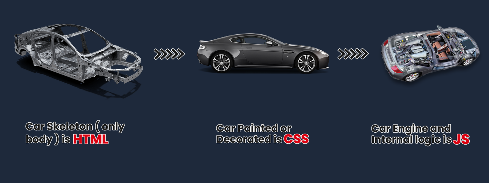

<style>
  body {
    text-align: justify;
  }
</style>

<h1 style="text-align: center;">INTRODUCTION</h1>

## What is HTML?

- **HTML** (Hypertext Markup Language) was created by Tim Berners-Lee in 1991 as a standard for creating web pages.
- It is a markup language used to structure content on the web, defining elements like headings, paragraphs, links, and images.
- HTML forms the backbone of web content.
- In layman's terms, HTML is like the skeleton of a website.
- It is a set of instructions that tells a web browser how to display text, images, videos, and other elements on a webpage.
- Think of it as the building blocks that create the structure and appearance of a website, similar to how bricks and mortar are used to build a house.
- HTML is the language of the web, used to create websites.
- HTML defines the basic structure or layout of web pages that we see on the Internet.
- HTML consists of a set of tags contained within an HTML document, and the associated files typically have either a **.html** or **.htm** extension.
- There are several versions of HTML, with HTML5 being the most recent.

## Features of HTML

- It is platform-independent. For example, Chrome displays the same pages identically across different operating systems such as Mac, Linux, and Windows.
- Images, videos, and audio can be added to a web page (for example, YouTube shows videos on their website).
- HTML is a markup language, not a programming language.
- It can be integrated with other languages like CSS and JavaScript to create interactive (or dynamic) web pages.

## Why the Term HyperText & Markup Language?

- The term **Hypertext Markup Language** is composed of two main words: **hypertext** and **markup language**.
- **Hypertext** refers to the linking of text with other documents, while **markup language** denotes a language that utilizes a specific set of tags.
- Thus, HTML is the practice of displaying text, graphics, audio, video, etc., in a certain way using special tags.

- **Note:**
  - Tags are meaningful texts enclosed in angle brackets, like `<...>`. For example, the `<head>` tag.
  - Each tag has a unique meaning and significance in building an HTML page, and it can influence the web page in various ways.

## A beautiful analogy to understand HTML, CSS, and JavaScript:



- In building a webpage, think of HTML, CSS, and JavaScript as different parts of a car.
- HTML is like the car's skeleton, forming the basic structure and frame.
- CSS adds the paint and finishing touches, making the car look appealing with color, style, and design.
- JavaScript is similar to the engine and mechanical parts, infusing the car with functionality, movement, and interactive features.
- Similarly, when developing a website, HTML lays out the structure, CSS enhances its visual appeal, and JavaScript provides interactivity and dynamic content

## History of HTML

- In 1989, Tim Berners-Lee established the World Wide Web (WWW), and in 1991, he created the first version of HTML.
- From 1995 to 1997, further work was done to develop and refine different versions of HTML.
- In 1999, a committee was organized that standardized HTML 4.0, a version still used by many today.
- The latest and most stable version of HTML is 5, also known as HTML5.
- HTML5 introduced new elements like `<article>`, `<section>`, and `<video>`, enhancing semantic structure and multimedia support.

## Example of Basic HTML Structure

```html
<!DOCTYPE html>
<html>
  <head>
    <title>My First Web Page</title>
  </head>
  <body>
    <h1>Hello, World!</h1>
    <p>This is my first web page.</p>
  </body>
</html>
```

## Conclusion

HTML is the foundational language of the web, enabling the creation and structuring of content. Understanding HTML is essential for anyone looking to build websites or engage with web technologies.
