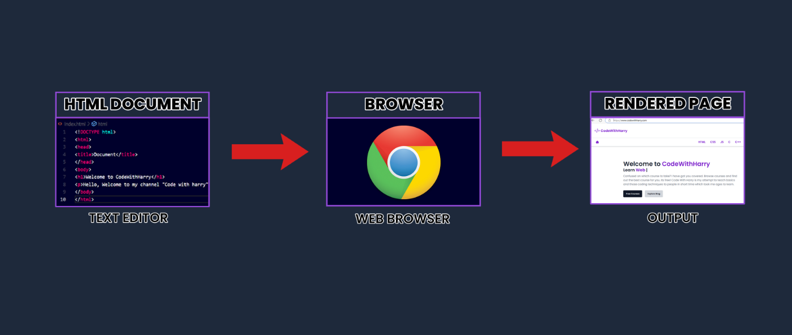

<h1 style="text-align: center;">HTML Working</h1>

## How do websites work?

- When we want to access any information on the internet, we search for it using a web browser.
- The web browser retrieves the content from web servers, where it is stored in the form of HTML documents.
- An HTML document is created by writing code with specific tags in a code editor of your choice.
- The document is then saved with the **.html** extension.
- Once saved, the browser interprets the HTML document, reads it, and renders the web page.

- The text editor has the HTML code of a website. This website can now be viewed in a beautifully rendered format using a computer program known as a web browser.

## What is a Web Browser?

- A web browser is a program that understands HTML tags and renders them in a human-readable format that is easily viewable by people visiting the website.
- Developers write code in HTML because it's a straightforward way to instruct the web browser on what to display.

## What is an HTML Document?

- An HTML document is a text document saved with the **.html** or **.htm** extension, containing text and specific tags enclosed in `<>`.
- These tags provide the necessary instructions for configuring the web page.
- The tags themselves are standardized and fixed.

## Common HTML Attributes

Here are some common attributes used in HTML tags:

- `href`: Used in `<a>` tags to specify the URL of the page the link goes to.
- `src`: Used in `` tags to specify the path to the image file.
- `alt`: Provides alternative text for an image if it cannot be displayed.
- `class`: Used to specify a class for an HTML element, which can be targeted by CSS.
- `id`: Used to specify a unique identifier for an HTML element, which can also be targeted by CSS and JavaScript.

## What is a Rendered Page?

- The rendered page is the output screen of our HTML Document, which is the page displayed on the browser.

## How does a basic website work?

- Web Browser (client) requests websites like [www.google.com](https://www.google.com/) from the web server.
- Web Server, in return, sends HTML, CSS, and JavaScript files to it.
- HTML, CSS, and JavaScript files are parsed by a web browser, which is responsible for showing you a beautiful website.

## How does a browser work?

- A web browser plays a crucial role in parsing and rendering HTML code to the client. A web browser is a complex program that performs many tasks behind the scenes. Here's a summary of how it works:
  - A browser is an application that reads HTML documents and displays them as web pages. The browser can't access the content directly from where it's stored; this is where servers come into play.
  - A server acts as an intermediary, listening to browser requests and fulfilling them by delivering the HTML document to the browser.
  - Web browsers perform two main tasks: parsing and rendering.
  - During the parsing stage, the browser receives raw bytes, which are converted into characters. These characters are then converted into tokens, which in turn are transformed into nodes. These nodes are organized into a tree-like data structure known as the DOM (Document Object Model).
  - Once the DOM tree is constructed, the browser moves on to the rendering stage. At this point, each node in the DOM tree is rendered and displayed on the screen.

## Best Practices for Writing HTML

- Use semantic HTML tags to improve accessibility and SEO.
- Keep your code clean and well-organized for easier maintenance.
- Always include `alt` attributes for images to enhance accessibility.

## Resources for Learning HTML

- [W3Schools HTML Tutorial](https://www.w3schools.com/html/)
- [MDN Web Docs on HTML](https://developer.mozilla.org/en-US/docs/Web/HTML)
- [Codecademy HTML Course](https://www.codecademy.com/learn/learn-html)

## Conclusion

Understanding HTML is essential for anyone looking to build websites or engage with web technologies.
