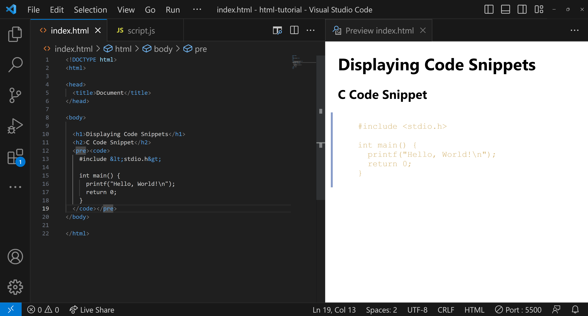

<style>
  body {
    text-align: justify;
  }
</style>

<h1 style="text-align: center;">HTML Code Tag</h1>

<b>The HTML `<code>` tag is a powerful element for displaying code snippets within a webpage. It preserves both spaces and line breaks, making it ideal for showcasing code. In this blog post, we'll explore how to use the `<code>` tag effectively, especially in conjunction with Prism for code highlighting.</b>

## What is the `<code>` Tag?

The `<code>` tag is a semantic HTML tag that's used for displaying code snippets. It can be used both inline and within a block-level element like `<pre>`.

## Why Use the `<code>` Tag?

- **Semantic Meaning:** Provides semantic value to the enclosed code.

- **Readability:** This makes it easier for both browsers and developers to understand that the text is code.

- **Styling:** Easier to style and highlight with CSS or JavaScript libraries like Prism.

## Basic Usage

The most straightforward way to use the `<code>` tag is inline for short code snippets:

```html
<code>Your code here</code>
```



## Using `<code>` with `<pre>`

For multiline code snippets, it's common to combine the `<code>` tag with the `<pre>` tag:

```html
<pre><code>Your multiline code here</code></pre>
```

## Conclusion

The HTML `<code>` tag is a simple yet powerful way to include code snippets in your webpage.
