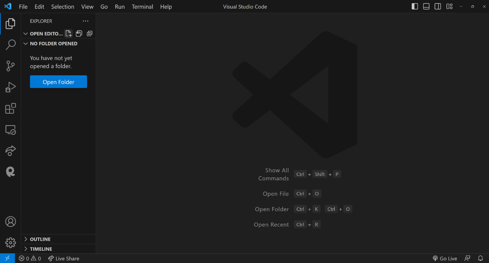
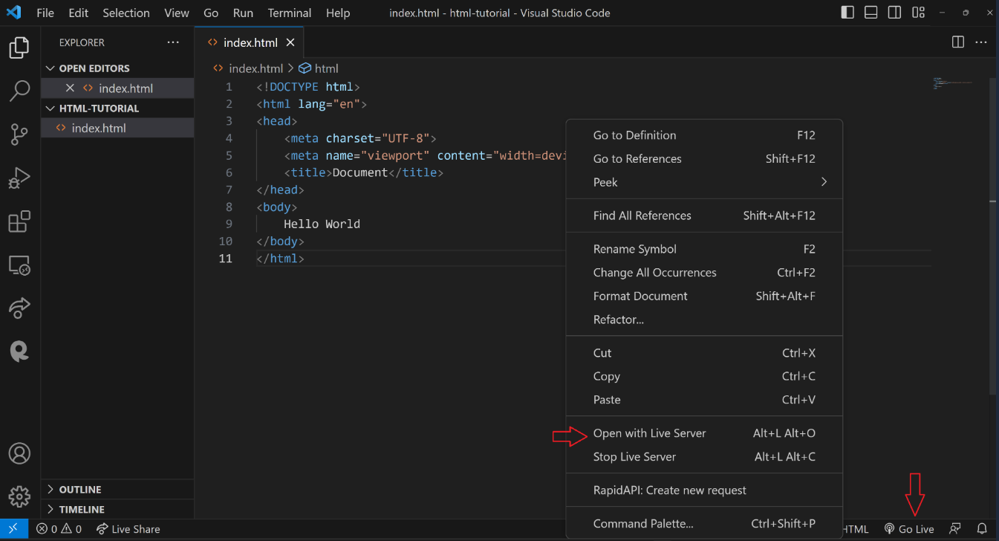
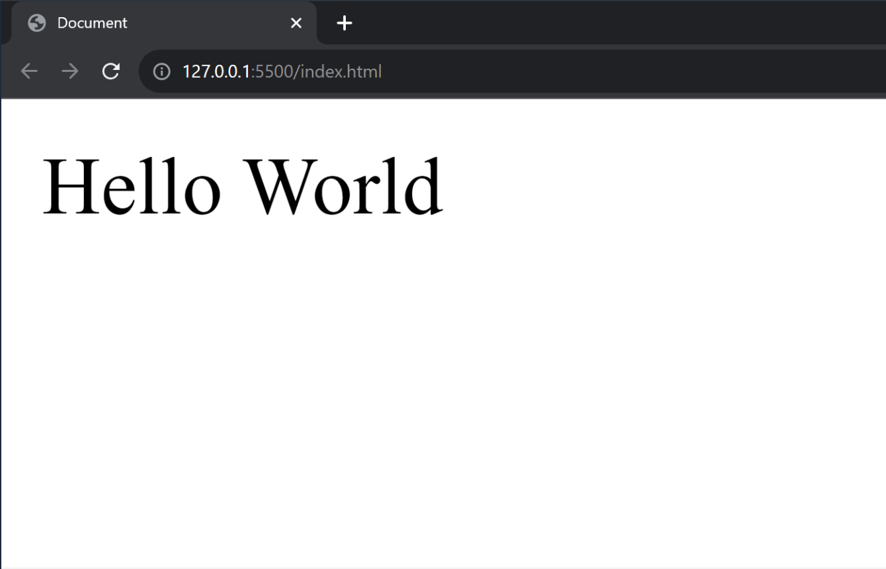
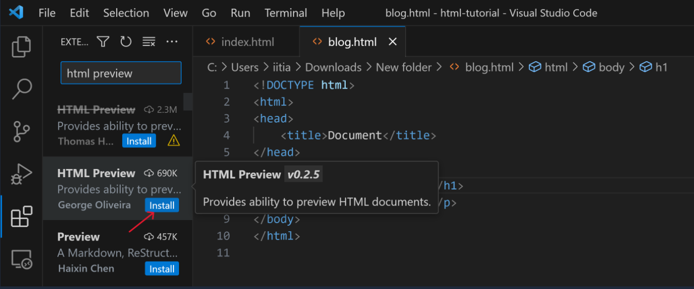
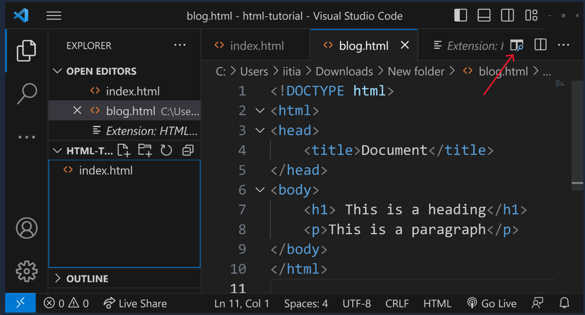
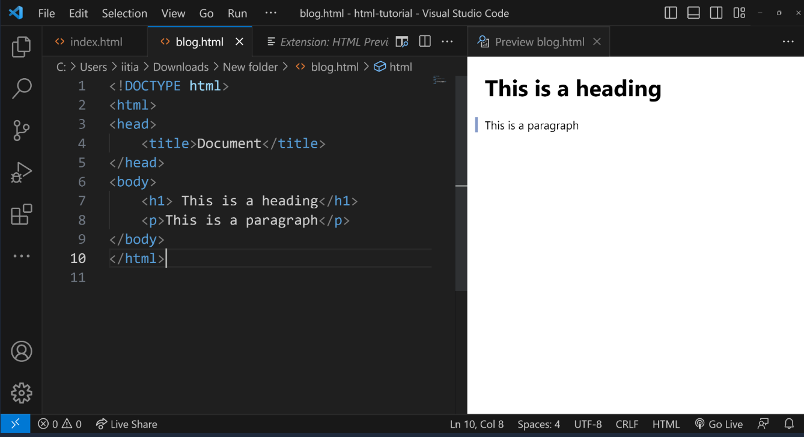

<style>
    body {
        text-align: justify;
    }
</style>

<h1 style="text-align: center;">HTML Execution</h1>

## Why "Hello, World!"?

- In the programming world, **Hello, World!** is more than just a phrase.
- It's a tradition, an emotion, and a simple program that teaches you the syntax and gets you started.

## Let's Get Started: Setting Up Your VS Code

- If you haven't already set up your environment, begin by opening [Visual Studio Code](https://code.visualstudio.com/download).



### Creating a New File

1. Click on **Open Folder** and select a folder where you want to start coding on your computer.
2. Once VS Code is open, create a new file:
   - Click on the **New File** icon in VS Code.
   - Name the file **index.html** and hit Enter.
3. Type `!` in your file and press Enter. This will generate a boilerplate for your HTML file.
4. Write "Hello World" inside the `<body>` tag and save the file. Your file should look like this:

   ```html
   <!DOCTYPE html>
   <html lang="en">
     <head>
       <meta charset="UTF-8" />
       <meta name="viewport" content="width=device-width, initial-scale=1.0" />
       <title>Document</title>
     </head>
     <body>
       Hello World
     </body>
   </html>
   ```

### Going Live using the "live server" extension

- To see your webpage in action, locate the **Go Live** icon at the bottom-right corner of your VS Code window and click it.
- If you don't see this icon, then install the **Live Server** extension.



- Now you can see your webpage on browser.



## Live Preview Extension

- Another useful extension for working with HTML in VS code is **HTML Preview**.
- To install it, simply click on the extensions icon in VS Code and type **HTML Preview** in the search bar and install it.



- Now you can see a button within VS Code. Clicking on button will allow you to preview your HTML right within the editor.



- Once you click the button, you'll see a live preview of your HTML directly within VS Code.



- You don't even need a browser to render plain HTML. This live preview feature in VS Code is perfect for this HTML tutorial, allowing you to build and preview your entire HTML website without ever leaving the editor.

## Conclusion

- In this tutorial, we learned the basics of HTML execution by creating a simple "Hello, World!" program. We set up our environment in Visual Studio Code, created our first HTML file, and explored how to view it using the Live Server and HTML Preview extensions. With these foundational skills, you're now ready to dive deeper into web development. Happy coding!
