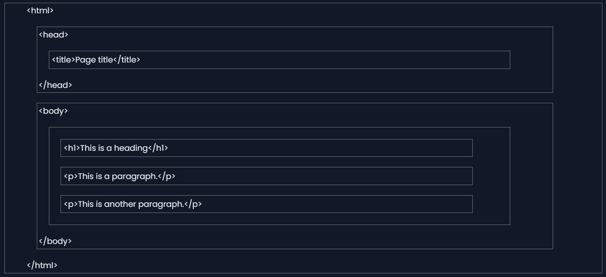
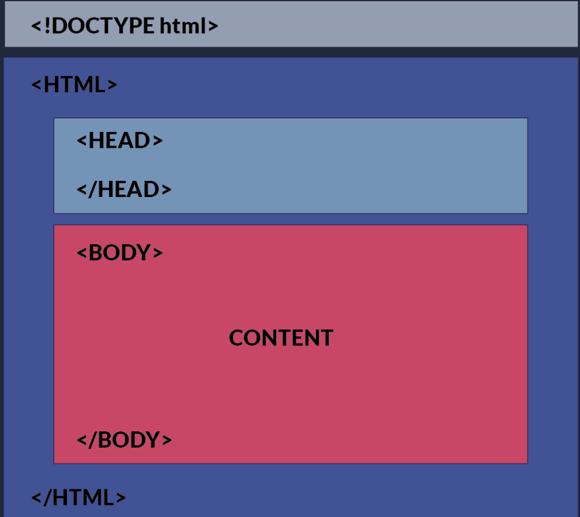
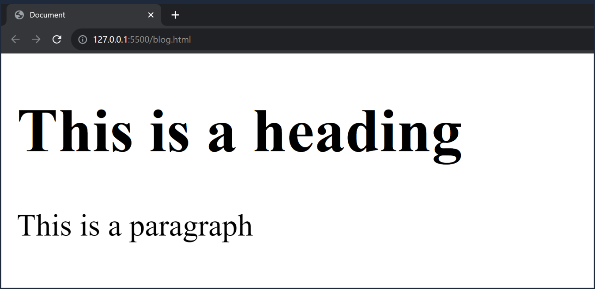

<style>
    body {
        text-align: justify;
    }
</style>

<h1 style="text-align: center;">HTML Structure</h1>

## HTML Page Structure

- An HTML document is structured using a set of nested tags.
- Each tag is enclosed within `<…>` angle brackets and acts as a container for content or other HTML tags.
- Let's take a look at a basic HTML document structure:

  ```html
  <!DOCTYPE html>
  <html>
    <head>
      <title>Document</title>
    </head>
    <body>
      <!-- content -->
    </body>
  </html>
  ```

  

### DOCTYPE Declaration

- `<!DOCTYPE html>`
  - The `<!DOCTYPE html>` declaration informs the web browser about the HTML version being used.
  - The latest version is HTML5.
  - This declaration will remain relevant even if HTML versions change in the future.

### HTML Root Element

- `<html>`
  - The `<html>` tag is the root element that encapsulates all the content on the page.
- `</html>`
  - The `</html>` tag marks the end of the `<html>` section.

### Head Section

- `<head>`
  - The `<head>` tag contains metadata and links to external resources like CSS and JavaScript files.
- `</head>`
  - The `</head>` tag marks the end of the `<head>` section.

### Title Tag

- `<title>Document</title>`
  - The `<title>` tag sets the title of the web page, which is displayed in the browser's title bar or tab.

### Body Tag

- `<body>`

  - The `<body>` tag contains the visible content of the web page. This is where text, images, and other elements go.

- `</body>`
  - The `</body>` tag marks the end of the visible content of the web page.

**Every HTML page should include at least these essential elements to define the basic layout.**

## Summary

- The `<!DOCTYPE html>` tag specifies that the document is an HTML5 document.
- The `<html lang="en">` tag defines the document to be in English.
- The `<head>` section contains metadata and the title of the webpage, which appears in the browser's title bar.
- The `<body>` section contains the content that will be displayed on the webpage.
- In the browser, the title bar will display the content from the `<head>` section, specifically the `<title>` tag.
- The main area of the browser window (usually a white background) will display the content inside the `<body>` tag.

### Visualization of an HTML Document:

- The following image provides a visual representation of the HTML structure:



### How This Content Appears in a Web Browser:

- Consider this html code:
  ```html
  <!DOCTYPE html>
  <html>
    <head>
      <title>Document</title>
    </head>
    <body>
      <h1>This is a heading</h1>
      <p>This is a paragraph</p>
    </body>
  </html>
  ```
- Below is an image showing how this HTML document will be rendered in a web browser:



## Conclusion

Understanding the structure of an HTML document is essential for web development. Mastering the key components—`<!DOCTYPE html>`, `<html>`, `<head>`, `<title>`, and `<body>`—ensures that web pages are functional and user-friendly.
