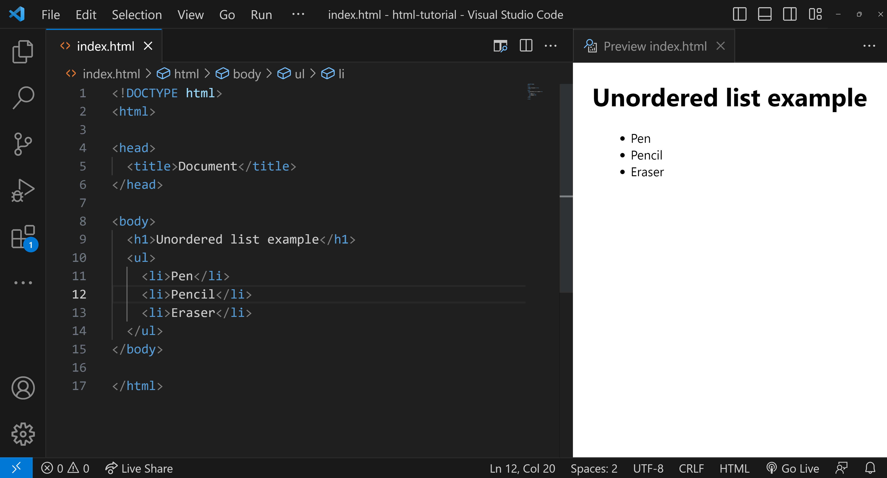
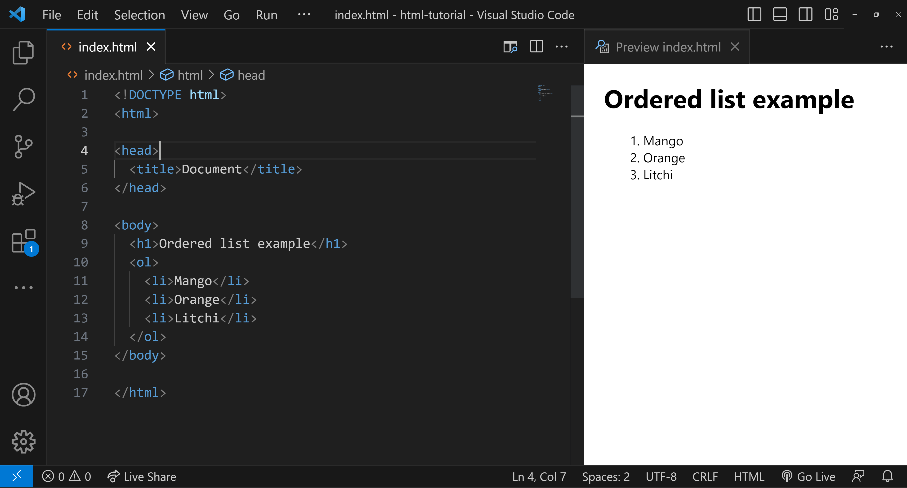

<h1 style="text-align: center;">HTML Lists</h1>

<b>Our day-to-day lives often involve the use of lists. For example, when we go shopping, the bill we receive includes a list of all the items we've purchased. In a similar manner, web developers use lists to neatly display data on websites.</b>

## Types of HTML Lists

HTML provides different types of lists to display data in various forms. Each list contains one or more list items.

- **Unordered List:** Displays items using bullets.
- **Ordered List:** Displays items in a numerical sequence, and supports various numbering styles like Arabic numerals, Roman numerals, and so on.
- **Definition List:** Organizes items in a format similar to a dictionary, with terms and their corresponding definitions.

## An Unordered List

An unordered list uses bullets to display items. It is suitable for listing items where the order doesn't matter. We will soon explore unordered lists in great detail

## An Ordered List

An ordered list uses numbers or other types of markers to indicate the sequence of items. It's ideal for listing steps in a process or ranking items in order of importance. We will soon explore ordered lists in great detail

## A Definition List

A definition list arranges items in a way similar to a dictionary, with a term followed by its definition. This is useful for glossaries or to display metadata.

## Conclusion

In summary, HTML lists are essential tools for organizing and presenting information on the web. Whether using unordered lists for non-sequential items, ordered lists for steps or rankings, or definition lists for terms and their meanings, each type serves a unique purpose. Understanding how to effectively use these lists enhances the clarity and usability of web content, making it easier for users to navigate and comprehend the information presented.
