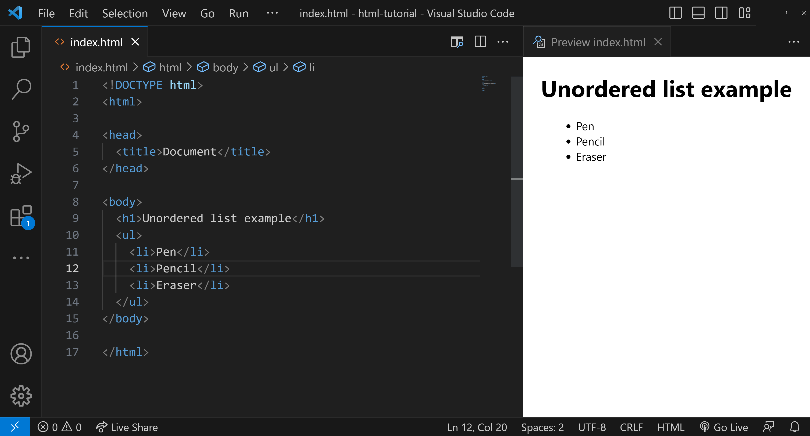

<style>
  body {
    text-align: justify;
  }
</style>

<h1 style="text-align: center;">HTML Unordered List</h1>

<b>An unordered list is a list of items that are not arranged in any specific, sequential order. Unlike ordered lists, the items in an unordered list are typically marked with bullet points, dashes, or other symbols to indicate list membership, but these markers do not imply any particular order.</b>

## Syntax for Creating Unordered Lists



## Key Characteristics of Unordered Lists

- No specific sequence is required.
- Typically displayed as bullet points.
- Defined using the `<ul>` tag.
- Individual items use the `<li>` tag.

## Basic Example

```html
<ul>
  <li>Pen</li>
  <li>Pencil</li>
  <li>Eraser</li>
</ul>
```

### Output:

- Pen
- Pencil
- Eraser

## Customizing Bullet Points with 'type' Attribute

You can specify the style of bullet points using the type attribute. It supports three values:

- disc - default bullet style
- square
- circle

## Example Using Square Bullets:

```html
<ul type="square">
  <li>Notebook</li>
  <li>Marker</li>
</ul>
```

### Output


## Conclusion

HTML unordered lists provide a flexible way to present items without a specific order. By utilizing the `<ul>` and `<li>` tags, developers can create visually appealing lists with customizable bullet styles. Mastering unordered lists is essential for enhancing the readability and organization of web content, making it easier for users to engage with the information.
