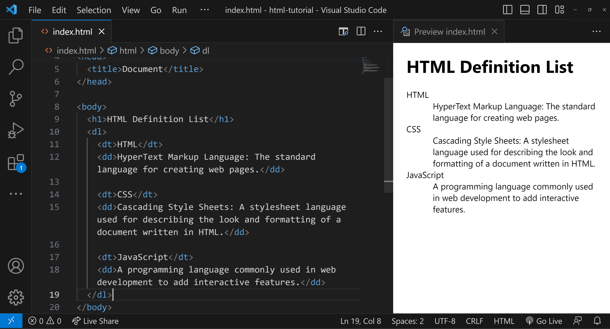

<style>
  body {
    text-align: justify;
  }
</style>

<h1 style="text-align: center;">HTML Definition List</h1>

<b>A Definition List in HTML is used to represent a list of terms along with their corresponding descriptions or definitions. The Definition List is created using the `<dl>` (Definition List) element, which wraps around one or more pairs of `<dt>` (Definition Term) and `<dd>` (Definition Description) elements.</b>

## Syntax



## Definition List Example

Here's a simple example to illustrate:

```html
<h1>HTML Definition List</h1>
<dl>
  <dt>HTML</dt>
  <dd>
    HyperText Markup Language: The standard language for creating web pages.
  </dd>

  <dt>CSS</dt>
  <dd>
    Cascading Style Sheets: A stylesheet language used for describing the look
    and formatting of a document written in HTML.
  </dd>

  <dt>JavaScript</dt>
  <dd>
    A programming language commonly used in web development to add interactive
    features.
  </dd>
</dl>
```

### Understanding the example

In this example:

- `<dl>` is the container for the list.
- `<dt>` defines the terms that you want to explain.
- `<dd>` contains the definitions or explanations for the terms.

[Video Sample](./assets/definition-list.mp4)

This creates a clean, organized way to present a list of terms and their corresponding definitions, much like a glossary or dictionary.

## Conclusion

In conclusion, the HTML Definition List is an effective way to present terms and their corresponding definitions in a clear and organized manner. By using the `<dl>`, `<dt>`, and `<dd>` elements, developers can create a glossary-like format that enhances the readability and comprehension of content. Mastering this structure is essential for any web developer looking to improve the clarity of their web pages.
