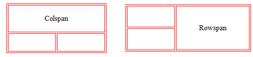

<style>
  body {
    text-align: justify;
  }
</style>

<h1 style="text-align: center;">HTML Tables</h1>

<b>HTML tables allow you to arrange data like text, images, and links in rows and columns. You use the `<table>` tag to start and end a table.</b>

## Syntax of HTML Table

```html
<table>
  // table content
</table>
```

## Key Elements of HTML Table

- `<table>`: Defines the table itself.
- `<tr>`: Used for table rows.
- `<th>`: Used for table headings.
- `<td>`: Used for table cells (data).

## Basic Table Structure

```html
<table>
  <tr>
    <th>Name</th>
    <th>Age</th>
  </tr>
  <tr>
    <td>Harry</td>
    <td>100</td>
  </tr>
</table>
```

## rowspan and colspan Attributes

**Rowspan:** If you want a table cell to span multiple rows, you can use the rowspan attribute.

```html
<td rowspan="value"></td>
```

**Colspan:** If you want a table cell to span multiple columns, you can use the colspan attribute.

```html
<td colspan="value"></td>
```

## Visual Representation of Rowspan and Colspan



## Examples

Here are simple examples to demonstrate the use of rowspan and colspan in HTML tables.

### Example for Colspan:

```html
<table border="1">
  <tr>
    <td colspan="2">Merged Columns</td>
  </tr>
  <tr>
    <td>Column 1</td>
    <td>Column 2</td>
  </tr>
</table>
```

### Example for Rowspan:

```html
<table border="1">
  <tr>
    <td>Row 1, Column 1</td>
    <td rowspan="2">Merged Rows</td>
  </tr>
  <tr>
    <td>Row 2, Column 1</td>
  </tr>
</table>
```

## Conclusion

In summary, HTML tables are a powerful tool for organizing and displaying data in a structured format. By utilizing the key elements such as `<table>`, `<tr>`, `<th>`, and `<td>`, along with attributes like `rowspan` and `colspan`, developers can create versatile and visually appealing tables. Understanding how to effectively implement tables enhances data presentation on web pages, making it easier for users to interpret and interact with information.
